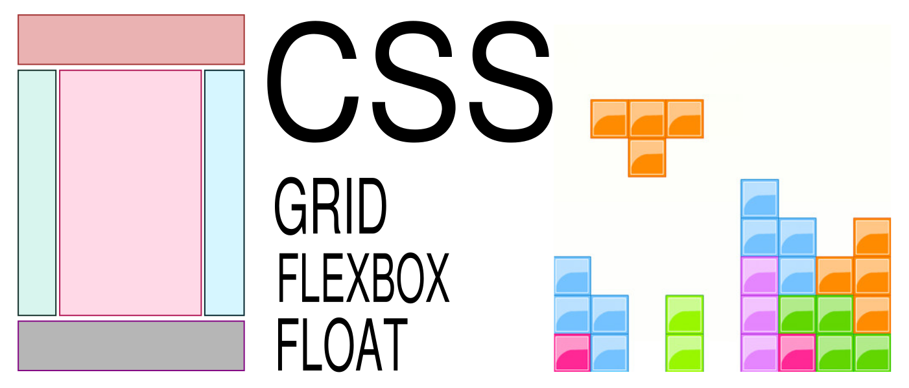

# Different ways to start your project layouts using Floats, Flexbox and Grid CSS for beginners

> On this project you will find the basic code for ....

## Built With

- HTML
- CSS
- Floats and Positioning
- Grid
- FlexBox

## Author

👤 **Ruben Paz Chuspe**

- Github: [@rubenpazch](https://github.com/rubenpazch)
- Linkedin: [rubenpch](https://www.linkedin.com/in/rubenpch/)

## 🤝 Contributing

Contributions, issues and feature requests are welcome!

Feel free to check the [issues page](issues/).

## Show your support

Give a ⭐️ if you like this project!

## Acknowledgments

- Hat tip to anyone whose code was used
- Inspiration
- etc

## 📝 License

This project is [MIT](lic.url) licensed.
